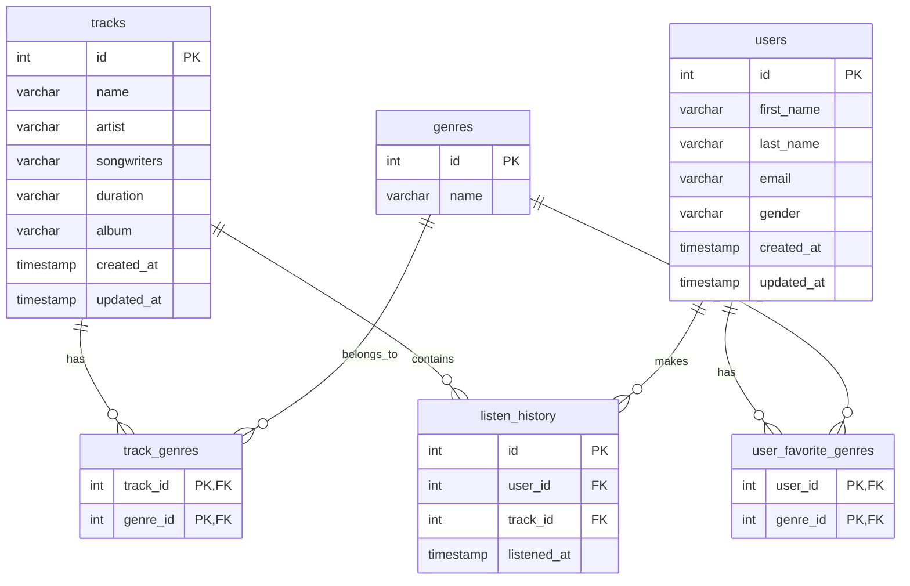
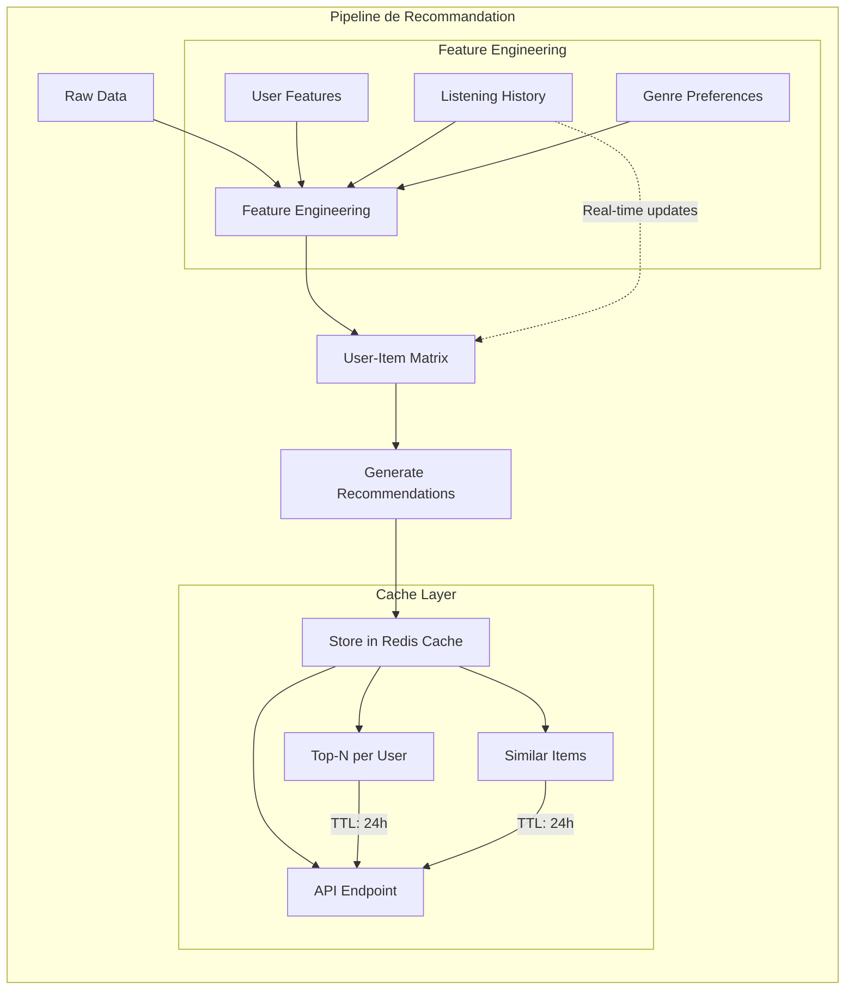

# Réponses du test

## _Installation et utilisation de la solution (étapes 1 à 3)_

La solution peut être déployée de deux manières différentes, offrant une flexibilité selon vos besoins :

### Option 1 : Avec Docker (Base de données MySQL)

1. Activez votre environnement virtuel Python
2. Installez les dépendances :
```bash
pip install -r requirements.txt
pip install -e .
```
3. Démarrez le conteneur Docker :
```bash
cd src/moovitamix_etl
docker-compose up
```

Une fois le conteneur initialisé, vous pouvez exécuter le pipeline avec différentes options :
```bash
# Exécution standard
python -m src.moovitamix_etl.pipeline

# Exécution avec logs détaillés
python -m src.moovitamix_etl.pipeline --log-level=DEBUG
```

### Option 2 : Sans Docker (Export CSV)

Si vous préférez ne pas utiliser Docker, vous pouvez exécuter le pipeline avec export CSV :
```bash
# Export vers le dossier par défaut
python -m src.moovitamix_etl.pipeline --into-csv

# Export vers un dossier spécifique
python -m src.moovitamix_etl.pipeline --into-csv='/path/to/csv_folder'
```

## Questions (étapes 4 à 7)

### Étape 4 : Choix et justification de l'architecture de données

Pour cette solution, j'ai opté pour une base de données relationnelle (MySQL ou PostgreSQL) plutôt qu'une solution NoSQL, et ce pour plusieurs raisons :

1. **Structure des données** : 
   - Les données sont doivent être structurées
   - Les bases NoSQL sont plus adaptées aux données non structurées et à la recherche textuelle

2. **Intégrité des données** :
   - Le schéma proposé garantit la cohérence des données
   - Prévention des enregistrements orphelins
   - Protection contre les incohérences potentielles générées par l'API de données aléatoires

3. **Avantages pour le Machine Learning** :
   - Facilite la création de matrices user-item pour les systèmes de recommandation collaboratifs
   - Permet un calcul efficace des fréquences d'écoute
   - Normalisation des genres pour une meilleure catégorisation

4. **Bénéfices opérationnels** :
   - Qualité supérieure des données grâce à la normalisation
   - Maintenance simplifiée du système de recommandation
   - Possibilité de construire des features complexes

Le schéma de base de données proposé est le suivant :



Cette architecture relationnelle offre une base solide pour :
- L'analyse des comportements d'écoute
- La construction de systèmes de recommandation robustes
- La maintenance à long terme du système
- L'évolution future des fonctionnalités

#### Étape 5 : Surveillance du pipeline et métriques clés

Pour assurer une surveillance efficace du pipeline ETL quotidien, je propose de suivre plusieurs types de métriques clés :

#### 1. Métriques de Performance
Il est essentiel de suivre :
- Le temps d'exécution de chaque phase (Extract, Transform, Load)
- L'utilisation des ressources (CPU, mémoire)
- La latence des requêtes d'extraction

#### 2. Métriques de Qualité des Données
La qualité des données peut être évaluée via :
- La complétude des enregistrements
- La validité des formats (emails, timestamps)
- La cohérence des données entre les tables

#### 3. Métriques Volumétriques
Il faut surveiller quotidiennement :
- Le nombre de nouveaux enregistrements par table
- La croissance de la base de données
- Le volume des données transformées

Pour suivre ces métriques, je recommande :
1. La mise en place d'un système de logging et d'analyse avec graylog
2. Un dashboard de visualisation des métriques, grayloag pour debugger et investiguer precisement les erreurs
3. Un système d'alertes automatisées en cas d'anomalies, graphana pour une vision plus macro des ressources et leur etat de santé
4. Des rapports quotidiens, ou inspecter quotidiennement les outils de diagnostic du pipeline

Cette approche permettra de :
- Détecter rapidement les problèmes
- Maintenir la qualité des données
- Optimiser les performances
- Faciliter la maintenance préventive

#### Étape 6 : Recommandation des musiques

##### Pipeline de Recommandation en temps réel
Le pipeline de recommandation effectue l'ingestion des données brutes pour les transformer en features pertinentes. Ces features alimentent une matrice user-item qui permet de générer les recommandations. Pour optimiser les performances, les résultats sont stockés dans un cache Redis avant d'être exposés via une API.



#### Étape 7 : Ré entrainement du model

##### Pipeline de réentraînement

Le pipeline de réentraînement vérifie quotidiennement la qualité du modèle via une analyse de data drift. Si une dégradation est détectée, un réentraînement est déclenché automatiquement. Le nouveau modèle n'est déployé que s'il présente de meilleures performances que le modèle en production.

```mermaid
flowchart TB
    subgraph "Model Retraining Pipeline"
        A[Daily Data Update] --> B{Data Drift Check}
        B -->|No Significant Drift| C[Keep Current Model]
        B -->|Drift Detected| D[Trigger Retraining]
        
        D --> E[Feature Engineering]
        E --> F[Train New Model]
        F --> G[Evaluate Performance]
        
        G -->|Better Performance| H[Deploy New Model]
        G -->|Worse Performance| I[Keep Current Model]
        
        H --> J[Update Model Registry]
        J --> K[Update Production Endpoint]
        
        subgraph "Evaluation Metrics"
            G1[RMSE] --> G
            G2[MAP@K] --> G
            G3[NDCG] --> G
        end
        
        subgraph "Monitoring"
            L[Log Metrics]
            M[Alert Team]
            B --> L
            G --> L
            H & I --> M
        end
    end

```